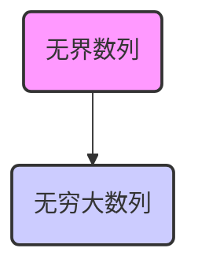

#易错 
核心围绕数列的“无穷大”和“无界”两个概念进行辨析，通过定义、图形、子列等角度阐释其区别与联系，并结合例题进行巩固。

## 1. 无穷大 (Infinitude) - 以数列为例

### 1.1. 定义 (文字表述)

设 $\{x_n\}$ 为一个数列。如果对于**任意**给定的正数 $M > 0$，**总存在**一个正整数 $N$，当 $n > N$ 时，都有 $|x_n| > M$，则称数列 $\{x_n\}$ 为无穷大，记作 $\lim_{n \to \infty} x_n = \infty$

### 1.2. 图形理解
![[3-1-无界与无穷大草图区别.png]]
*   **$M$ 的作用：** 想象一个水平的“界限”或“阈值”。
*   **$N$ 的作用：** 一个“分界点”。在 $N$ 之前（$n \le N$），数列的项可以任意取值。
*   **核心：** 一旦 $n$ 超过了 $N$（$n > N$），数列的所有项 $x_n$ 的绝对值 $|x_n|$ 都会**持续地**、**全部地**位于 $M$ 和 $-M$ 的外部。
    *   即 $x_n > M$ 或 $x_n < -M$。
*   **持续增加/减少的趋势：**
    *   因为 $M$ 是**任意给定**的，无论 $M$ 取多大，总能找到一个 $N$，使得 $N$ 之后的所有项都超过这个 $M$。
    *   这意味着数列的项会持续地向正无穷或负无穷（或两者交替地绝对值增大）发展，没有尽头。
    *   例如，如果 $M_1 < M_2 < M_3$，则对应的 $N_1 < N_2 < N_3$（通常情况下），$n > N_3$ 的所有项的绝对值都会大于 $M_3$。

## 2. 有界 (Bounded) - 以数列为例

### 2.1. 定义 (文字表述)

设 $\{x_n\}$ 为一个数列。如果**存在**一个正数 $M > 0$，使得对于**任意**的正整数 $n$，都有 $|x_n| \le M$，则称数列 $\{x_n\}$ 为有界数列。

### 2.2. 图形理解

*   **$M$ 的作用：** 想象一个固定的“罩子”或“框框”，其上下边界分别为 $M$ 和 $-M$。
*   **核心：** 有界数列的所有项 $x_n$ 都被完全“罩住”或“框住”在这个范围内，没有任何项会超出这个范围。

## 3. 无界 (Unbounded) - 以数列为例

### 3.1. 定义 (文字表述)

设 $\{x_n\}$ 为一个数列。如果对于**任意**给定的正数 $M > 0$，**总存在**一个正整数 $n_0$（或某个项的下标），使得 $|x_{n_0}| > M$，则称数列 $\{x_n\}$ 为无界数列。

*   **与无穷大的区别点：** 无穷大要求是 $N$ **之后的所有项**都满足 $|x_n| > M$；无界只要求**至少存在一个项**满足 $|x_{n_0}| > M$。

### 3.2. 图形理解

*   **$M$ 的作用：** 仍然是一个“罩子”，其上下边界分别为 $M$ 和 $-M$。
*   **核心：**
    *   无论你这个“罩子” $M$ 做得多大，无界数列**总会有一些项**能够“跳出”这个罩子的范围。
    *   可能有些项在罩子内，但一定会有项在罩子外。
    *   这个“罩子”永远无法把所有项都罩住。

## 4. 无穷大与无界的联系与区别 (核心)

### 4.1. 从子列角度理解

*   **无界数列：** **至少存在一个**无穷大的子列。
    *   那些“跳出罩子”的点，如果持续跳出越来越大的罩子，就构成了无穷大子列。
*   **无穷大数列：** **所有子列**均为无穷大。
    *   因为从某一项 $N$ 开始，所有后续项的绝对值都持续增大超过任意 $M$，那么它的任何一个子列从某一项开始也必然具有此性质。

### 4.2. 推理关系

*   **无穷大 $\implies$ 无界** (正确)
    *   如果一个数列是无穷大，那么它所有的项从某一项开始绝对值都大于任意给定的 $M$，自然也满足无界的定义（总存在项的绝对值大于 $M$）。
*   **无界 $\implies$ 无穷大** (错误)
    *   无界只保证存在一个无穷大子列，但其他子列可能不是无穷大，甚至可能是有界的或收敛到某个常数。

### 4.3. 图示关系 (韦恩图)

可以想象一个大圆代表“无界数列”，一个小圆完全包含在大圆内部，代表“无穷大数列”。

*(这里用箭头表示包含关系，无穷大数列是无界数列的子集)*

## 5. 常见命题判断与反例 (重点)

### 5.1. 有界性相关
![[3-2-第一组.png]]
1.  **若 $\{x_n\}, \{y_n\}$ 均有界，则 $\{x_n + y_n\}$ 有界。** (正确)
    *   $|x_n| \le M_1, |y_n| \le M_2 \implies |x_n+y_n| \le |x_n|+|y_n| \le M_1+M_2$。
2.  **若 $\{x_n\}, \{y_n\}$ 均有界，则 $\{x_n \cdot y_n\}$ 有界。** (正确)
    *   $|x_n| \le M_1, |y_n| \le M_2 \implies |x_n \cdot y_n| = |x_n| \cdot |y_n| \le M_1 \cdot M_2$。
3.  **若 $\{x_n\}$ 有界，$\{y_n\}$ 无界，则 $\{x_n + y_n\}$ 无界。** (正确)
    *   $\{y_n\}$ 无界意味着它有无穷大子列 $\{y_{n_k}\}$。$\{x_n\}$ 有界意味着对应子列 $\{x_{n_k}\}$ 有界。有界量加无穷大量仍为无穷大量，所以 $\{x_n+y_n\}$ 存在无穷大子列，故无界。
4.  **若 $\{x_n\}$ 有界，$\{y_n\}$ 无界，则 $\{x_n \cdot y_n\}$ 无界。** (错误)
    *   **反例：** $x_n = 0$ (有界)，$y_n = n$ (无界)。则 $x_n \cdot y_n = 0$ (有界)。
    *   **关键：** 乘法中的零。

### 5.2. 无界性相关

5.  **若 $\{x_n\}$ 无界，$\{y_n\}$ 无界，则 $\{x_n + y_n\}$ 无界。** (错误)
    *   **反例 (抵消)：** $x_n = n$ (无界)，$y_n = -n$ (无界)。则 $x_n + y_n = 0$ (有界)。
6.  **若 $\{x_n\}$ 无界，$\{y_n\}$ 无界，则 $\{x_n \cdot y_n\}$ 无界。** (错误)
    *   **反例 (分奇偶构造0)：**
        *   $x_n = \begin{cases} 0, & n \text{ 为奇数} \\ n, & n \text{ 为偶数} \end{cases}$ (无界，因为偶数项子列是无穷大)
        *   $y_n = \begin{cases} n, & n \text{ 为奇数} \\ 0, & n \text{ 为偶数} \end{cases}$ (无界，因为奇数项子列是无穷大)
        *   则 $x_n \cdot y_n = 0$ (有界)。
    *   **重要思想：** 学会构造分段（如分奇偶）的数列作为反例。

### 5.3. 无穷大相关

7.  **若 $\{x_n\}$ 有界，$\{y_n\}$ 无穷大，则 $\{x_n \cdot y_n\}$ 无穷大。** (错误)
    *   **反例：** $x_n = 0$ (有界)，$y_n = n$ (无穷大)。则 $x_n \cdot y_n = 0$ (极限为0，不是无穷大)。
    *   **对比：** 无穷小 × 有界量 = 无穷小。但无穷大 × 有界量 $\neq$ 无穷大 (除非有界量不趋于0且不为0)。
8.  **若 $\{x_n\}$ 无界，$\{y_n\}$ 无穷大，则 $\{x_n \cdot y_n\}$ 无界。** (正确)
    *   $\{x_n\}$ 无界 $\implies$ 存在无穷大子列 $\{x_{n_k}\}$。
    *   $\{y_n\}$ 无穷大 $\implies$ 对应子列 $\{y_{n_k}\}$ 也是无穷大。
    *   $\{x_{n_k} \cdot y_{n_k}\}$ 是无穷大子列，所以 $\{x_n \cdot y_n\}$ 无界。
    *   **进一步提问：此时 $\{x_n \cdot y_n\}$ 是无穷大吗？** (不一定)
        *   **反例：**
            *   $x_n = \begin{cases} 0, & n \text{ 为奇数} \\ n, & n \text{ 为偶数} \end{cases}$ (无界)
            *   $y_n = n$ (无穷大)
            *   $x_n \cdot y_n = \begin{cases} 0, & n \text{ 为奇数} \\ n^2, & n \text{ 为偶数} \end{cases}$ (无界，但不是无穷大，因为奇数项子列极限为0)。

### 5.4. 极限运算相关

9.  **若 $\lim_{n \to \infty} (x_n \cdot y_n) = 0$，则必有 $\lim_{n \to \infty} x_n = 0$ 或 $\lim_{n \to \infty} y_n = 0$。** (错误)
    *   **反例 (与命题6类似)：**
        *   $x_n = \begin{cases} 0, & n \text{ 为奇数} \\ 1, & n \text{ 为偶数} \end{cases}$ (极限不存在)
        *   $y_n = \begin{cases} 1, & n \text{ 为奇数} \\ 0, & n \text{ 为偶数} \end{cases}$ (极限不存在)
        *   $x_n \cdot y_n = 0$，所以 $\lim_{n \to \infty} (x_n \cdot y_n) = 0$。但 $x_n, y_n$ 极限均不存在。
10. **若 $\lim_{n \to \infty} (x_n \cdot y_n) = +\infty$，则必有 $\lim_{n \to \infty} x_n = +\infty$ 或 $\lim_{n \to \infty} y_n = +\infty$。** (错误)
    *   **反例 (与命题6,9类似，调整0为1)：**
        *   $x_n = \begin{cases} 1, & n \text{ 为奇数} \\ n, & n \text{ 为偶数} \end{cases}$ (极限不存在，不是无穷大)
        *   $y_n = \begin{cases} n, & n \text{ 为奇数} \\ 1, & n \text{ 为偶数} \end{cases}$ (极限不存在，不是无穷大)
        *   $x_n \cdot y_n = n$，所以 $\lim_{n \to \infty} (x_n \cdot y_n) = +\infty$。但 $x_n, y_n$ 均不是无穷大。

## 6. 应用例题

### 例 1 (视频中的例2)

判断当 $x \to 0$ 时，变量 $f(x) = \frac{1}{x^2} \sin(\frac{1}{x})$ 的性质。

*   **分析：**
    *   当 $x \to 0$ 时，$\frac{1}{x^2} \to \infty$ (无穷大)。
    *   $\sin(\frac{1}{x})$ 是有界量 (值域为 $[-1, 1]$)。
*   **初步判断：** 无穷大 × 有界量，结果不确定。
*   **取子列/特殊点序列：**
    1.  取 $x_n = \frac{1}{2n\pi}$。当 $n \to \infty$ 时，$x_n \to 0$。
        *   $f(x_n) = (2n\pi)^2 \sin(2n\pi) = (2n\pi)^2 \cdot 0 = 0$。
        *   此子列的极限为 0。
    2.  取 $y_n = \frac{1}{2n\pi + \frac{\pi}{2}}$。当 $n \to \infty$ 时，$y_n \to 0$。
        *   $f(y_n) = (2n\pi + \frac{\pi}{2})^2 \sin(2n\pi + \frac{\pi}{2}) = (2n\pi + \frac{\pi}{2})^2 \cdot 1 \to \infty$。
        *   此子列的极限为 $+\infty$。
*   **结论：**
    *   因为存在一个子列趋于无穷大，所以函数 $f(x)$ 是**无界**的。
    *   因为存在一个子列极限为0 (而不是无穷大)，所以函数 $f(x)$ **不是无穷大**。
    *   **答案：D (无界但非无穷大)**

## 7. 总结

*   **无穷大**是比**无界**更强的概念。无穷大一定无界，但无界不一定无穷大。
*   关键区别在于：无穷大要求从某一项开始**所有项**的绝对值都持续超越任意界限；无界只要求**总能找到项**超越任意界限。
*   从子列看：无穷大的所有子列都是无穷大；无界至少有一个无穷大子列。
*   判断涉及乘除的命题时，要特别注意“0”这个特殊值。
*   构造反例时，分段定义的数列（如分奇偶）是非常有用的工具。
---